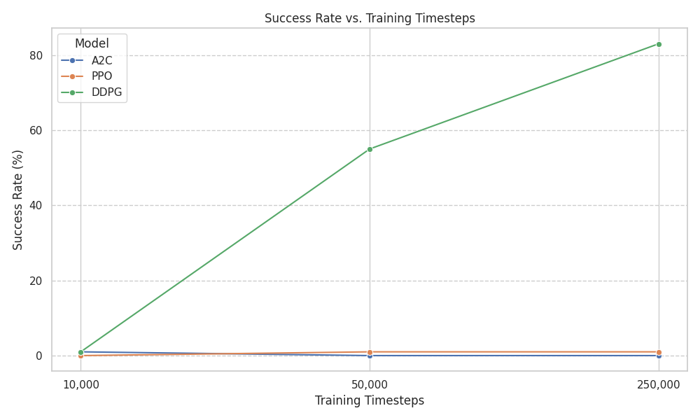
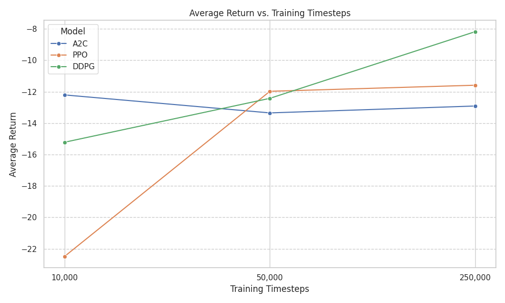

# By Ajlal Paracha and Alexander Matros

# License to Drive: An RL Agent's First Parking Test
*CS 486 Final Research Project: Comparing RL Algorithms for Autonomous Parking 🅿️🚗*

This project trains and evaluates three different Reinforcement Learning algorithms (A2C, PPO, DDPG) on the `parking-v0` environment from `highway-env`.

## Visualization of Training Progression

The following GIF shows the performance of each model after being trained for 10k, 50k, and 250k timesteps. Each segment displays a different test rollout, synchronized across all models.


## Results

### Success Rate vs. Timesteps


### Average Return vs. Timesteps


## Usage

### 1. Setup

First, install the required dependencies:

```bash
pip install -r requirements.txt
```

### 2. Train Models

To train all models for the predefined timesteps (10k, 50k, 250k), run the training script:

```bash
python src/train.py
```

Checkpoints for each model will be saved as .zip files in the /checkpoints directory.

### 3. Evaluate Models

To evaluate the trained models, generate performance graphs, and create a summary CSV, run the evaluation script:

```bash
python src/evaluate.py
```

Graphs and the evaluation_results.csv file will be saved in the /results directory.

### 4. Visualize Agent Performance

To generate `.mp4` video recordings of the trained agents performing the parking task, run the visualization script:

```bash
python src/visualize.py
```
Videos will be saved in the /videos directory, organized into subfolders by model and training timestep.
